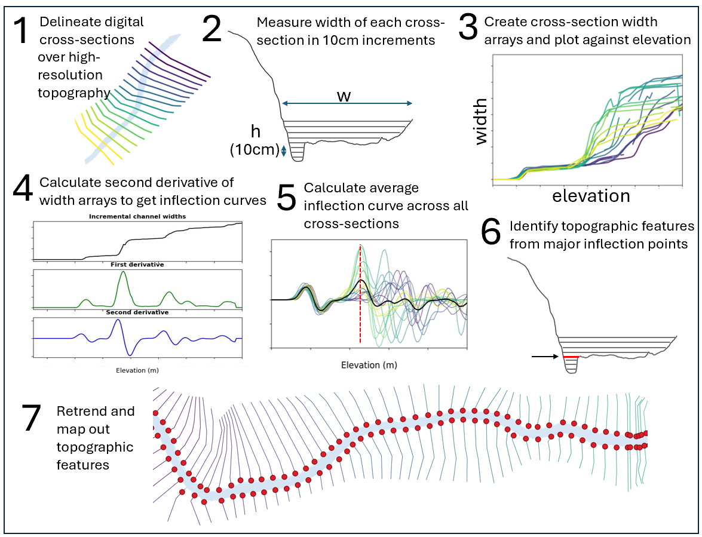
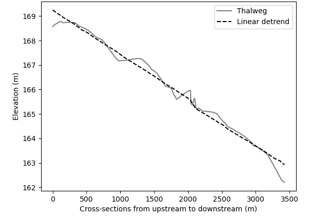
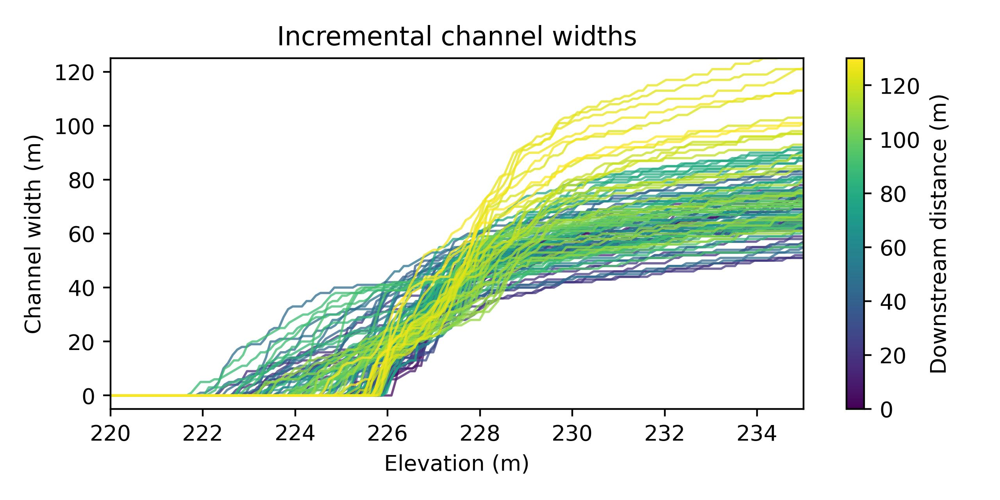
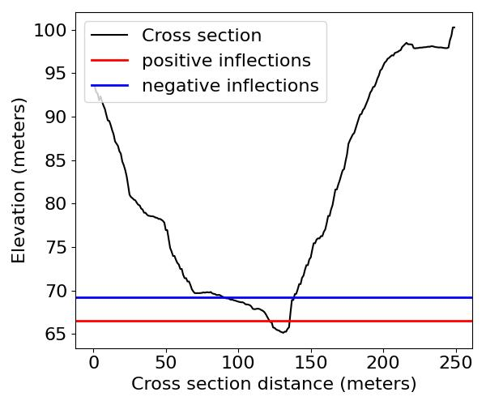
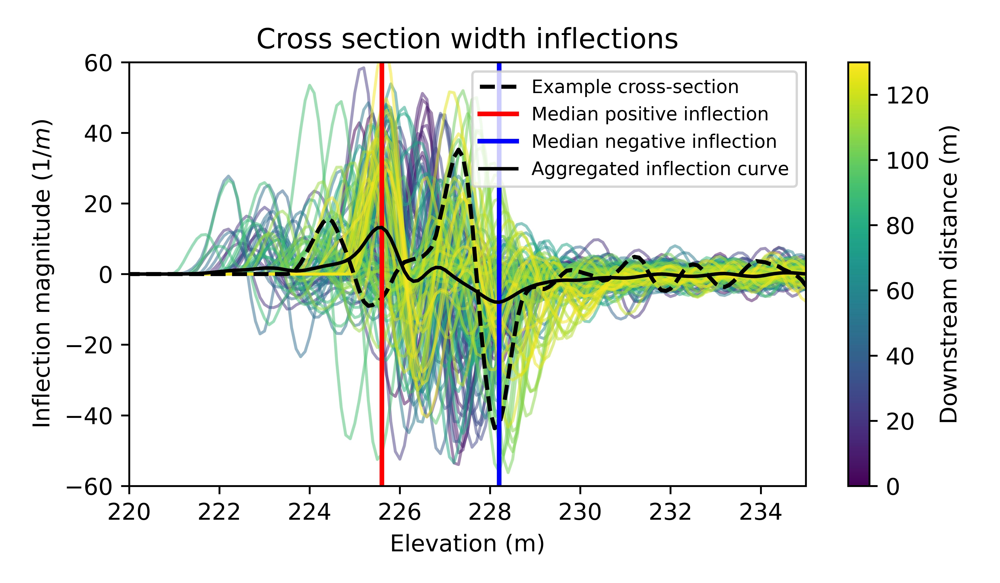
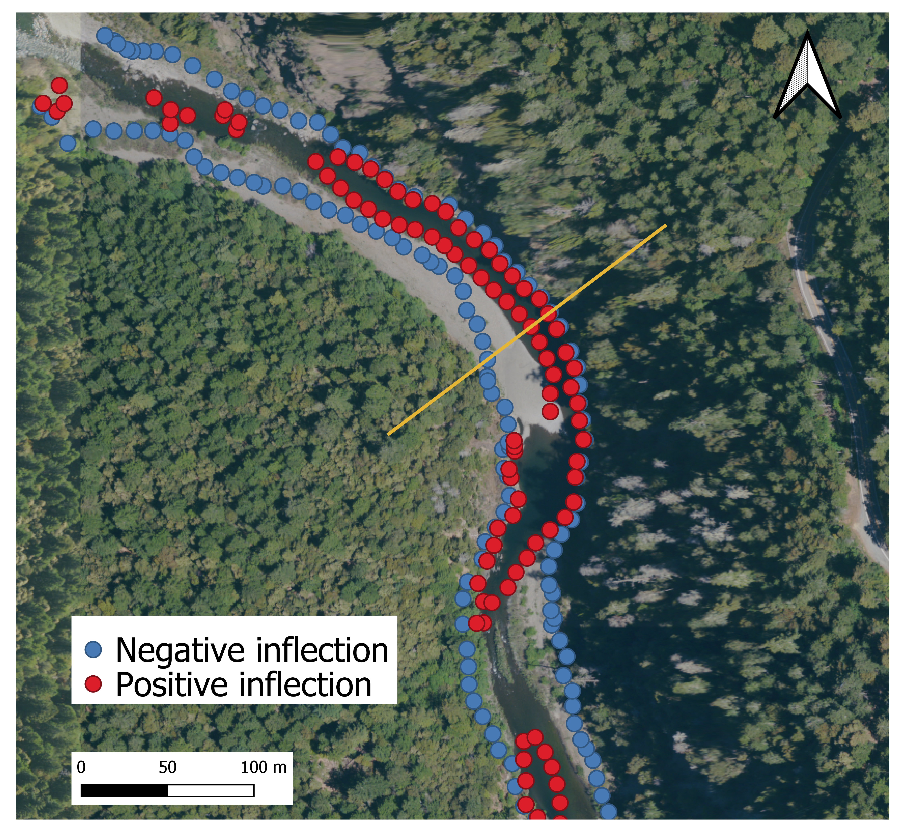

# INFLection-based Elevations from Channel Topography (INFLECT)

INFLECT is a software tool used to identify persistent topographic features of river corridors, such as bankfull and flood terraces. INFLECT uses cross-sections derived from digital elevation models to identify inflections in cross-section width, which are indicative of topographic features. Inputs to INFLECT are a DEM, a river thalweg/centerline, and a set of transects spanning the study reach. Outputs include a series of diagnostic figures described below, a set of elevations representing major topographic feature locations on the study reach, and a shapefile of topographic feature locations along the input transects. The steps of the INFLECT process are summarized in the figure below:



## Software Configuration

The steps in the dropdown section outline how to install the INFLECT tool and all dependencies required, for both Windows and Mac operating systems. Expand the section below for steps.

<details>
  <summary>Click to expand</summary>

  ### 1. Install Python 3
  
  #### Windows
  
  1. Download the latest version of Python 3 from [python.org/downloads](python.org/downloads)
  2. Run the installer:
  - On the first screen, check “Add Python 3.x to PATH”.
  - Click Install Now.
  3. Verify the installation by opening Command Prompt (`Win + R`, type `cmd`) and running:
    ```python
    python --version
    ```
  You should see a version starting with 3. (e.g., Python 3.12.1).
  
  #### Mac
  
  1. Open **Terminal**.
  2. Check if Python 3 is already installed:
  ```python
  python --version
  ```
  - If you see `Python 3.x.x`, you’re good to go.
  - If not, install it using [Homebrew](https://brew.sh/) (recommended):
      ```python
      brew install python
      ```
  3. Verify the installation:
     ```python
     python3 --version
     ```
  
  ### 2. Clone the Repository
  
  In your command line (Command Prompt on Windows, Terminal on Mac), navigate to the folder where you want to save INFLECT and run the following:
  ```python
  git clone https://github.com/NoellePatterson/INFLECT.git
  cd INFLECT
  ```
  
  ### 3. Create a Virtual Environment
  
  A virtual environment keeps software dependencies organized, and is the recommended approach for running Python code. Perform the following steps after you have navigated to the INFLECT directory in your command line (Step 2).
  
  #### Windows
  ```python
  python -m venv venv
  venv\Scripts\activate
  ```

  #### Mac
  ```python
  python3 -m venv venv
  source venv/bin/activate
  ```
  
  ### 4. Install Dependencies
  
  Once the virtual environment is activated, install required packages using pip, the Python installer:
  ```python
  pip install -r requirements.txt
  ```
</details>

---  

## Running the Code

Once you have configured the repository on your local machine, you are ready to start running the code and generating outputs. 

### 1. Upload user data

Add data for your study river reach to the `data_inputs` folder within the repository. There are three total geospatial data needs. **Make sure all geospatial files are in the same coordinate reference system!**

1. Add a **DEM** to the `data_inputs/dem` folder, in .TIF file format.
   
INFLECT has been developed and tested using a 1-m resolution DEM. It is highly recommended to use this resolution or similar with INFLECT. The DEM must cover the full extent of the thalweg and cross-section data inputs. 

2. Add a **thalweg line** to `data_inputs/thalweg` folder, as a line type shapefile in .shp file format.

The accuracy of the thalweg line is not critical to INFLECT performance, and a river centerline may be used instead. The length of river reach used in INFLECT is an ongoing research question and the user is encouraged to inspect results carefully when selecting river segment length. INFLECT has been developed with 1-5 km river reaches and this length is encouraged as a starting point. It is also crucial to avoid abrupt drops in the longitudinal profile of the reach, such as those caused by knickpoints or waterfalls, as these are not well-suited to the linear detrending performed in INFLECT.

3. Add **cross-sections** to the `data_inputs/cross_sections` folder, as a line type shapefile in .shp file format.
  
Cross-sections must be ordered from upstream to downstream. Cross-section width should be sized for the study site, and generally should cover the river corridor width of interest plus further extent up the valley walls. It is okay if cross-sections overlap. Cross-section spacing can be determined by the user and should be spaced closely enough to capture the occurrence of both riffles and pools. Spacings of 10-50 meters have been tested successfully in INFLECT. Cross-sections do not need to be evenly spaced. 

### 2. Specify reach name and input files

The reach name and names of input files must be specified in the `main.py` file of the repository. The reach name is essential because all output file names are appended with the user-specified reach name. These changes are made in lines 27-38 of main.py and look like the following example:
```python
reach_name = 'Eel_upstream'
dem_fp = 'data_inputs/dem/Eel_dem.tif' # file in 'data_inputs/dem/...' folder
thalweg_fp = 'data_inputs/thalweg/Eel_thLWEG.shp' # file in 'data_inputs/thalweg/...' folder
cross_sections_fp = 'data_inputs/cross_sections/Eel_xs.shp' 
```

### 3. Review INFLECT algorithm parameters

INFLECT algorithm parameters specify the details of calculating channel widths and calculating derivatives to determine major inflection points. Adjustable parameters are defined in main.py with default parameter values defined. A description of each parameter is included in the code and are listed here:

```python
# Set INFLECT algorithm parameters
plot_interval = 1 # set plotting interval along transect in units of meters
d_interval = 10/100 # Set intervals to step up in depth (in units meters). Default is 10cm intervals
slope_window = 10 # Set window size for calculating slope for derivatives
lower_bound = 5 # Set lower vertical boundary for inflection id within cross-section, in units of d_interval. Default 5 = 50cm
upper_bound = 100 # Set upper vertical boundary for inflection id within cross-section, in units of d_interval. Default 100 = 10m
spatial_plot_interval = 0.5 # interval for finding inflection elevation along cross_sections.
width_calc_method = 'partial' # 'continuous' 'partial' - choose from either partial additive widths or continuous-only methods of width calculation
```

Additionally, parameters are included that set the specifications for the peak detection algorithm used to identify major inflection points from the aggregated inflection curve. The parameters are applied to both positive and negative inflection point algorithms. The parameters can be adjusted individually for each version of the peak detection algorithm directly in the ```Analysis.py``` file. 

### 4. Run analysis functions

There are three analysis functions that perform the calculations necessary to identify major inflections indicating topographic features. All three functions are called from main.py and are listed below:

```python
all_widths_df = calc_dwdh(reach_name, cross_sections, dem, plot_interval, d_interval, width_calc_method)
```
This function calculates incremental channel widths for each cross section (Fig. 1), which are stored as a set of arrays and returned from the function as the data frame `all_widths_df`. 

```python
calc_derivatives_aggregate(reach_name, d_interval, all_widths_df, slope_window)
```
This function calculates the first and second derivatives of the width arrays from the function above (Fig. 1). The second derivative is the inflection curve of the channel width array. In this function, the average inflection curve is also calculated from the detrended width arrays (Fig. 1 step x) and the major inflections are identified (Fig. 1 step x). 

```python
output_record(reach_name, slope_window, d_interval, lower_bound, upper_bound, width_calc_method)
```
Finally, a report is generated to accompany the analysis. This report includes all parameters used in the run, and the outputs generated.

### 5. Run plotting functions

An assortment of plots can be generated to visualize the results of the INFLECT analysis. All plotting functions are called from ```main.py```. Plotting functions can be commented out to not run, which reduces the code runtime. Image sizing and axes limits may need to be adjusted manually for best results. 

#### 1. **Longitudinal Profile plot.** This can be used to determine if your study reach contains drops that may not work well with linear detrending in INFLECT. 

```python
plot_longitudinal_profile(reach_name, dem, cross_sections, plot_interval)
```


#### 2. **Incremental channel widths plot.** Each line represents a cross-section in the data. The channel width from each 10cm interval (default) is plotted against elevation in the channel. Elevation is detrended at each cross-section so that they approximately align, centered around the elevation of the highest cross-section. 

```python
plot_bankfull_increments(reach_name, d_interval)
```


#### 3. **Cross-section plots.** A plot is generated for every cross-section, with major inflection points overlaid. 

```python
transect_plot(cross_sections, dem, plot_interval, d_interval, reach_name)
```


#### 4. **Inflection curve plot.** The inflection curves are plotted for all cross-sections, which represent the second derivative of the incremental widths (plot #2). The mean inflection curve and major inflection points are overlaid. 

```python
plot_inflections(d_interval, reach_name)
```


#### 5. **Inflection point spatial outputs.** INFLECT generates shapefiles for major inflection points and where they align with the input cross-sections. These results can be mapped on any geospatial software.  

```python
create_bankfull_pts(cross_sections, dem, thalweg, d_interval, spatial_plot_interval, reach_name)
```



